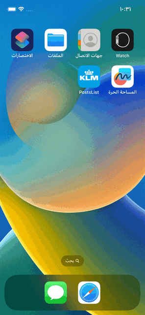
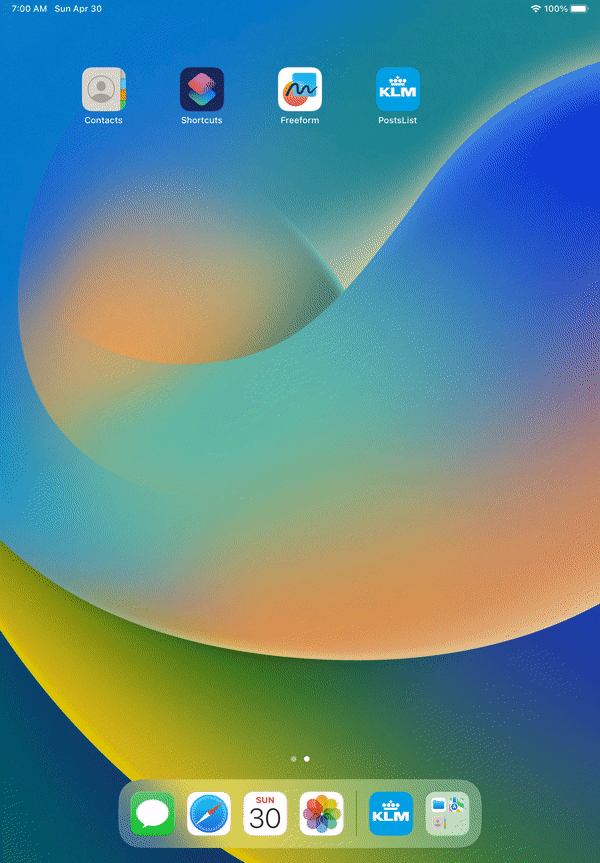

# PostsList

To fulfill the requirements of the second point, I suggest using two API endpoints:

### 1. Posts API endpoint:
http://jsonplaceholder.typicode.com/posts

This endpoint returns a list of posts with basic information such as title, body. I used this endpoint to display a list of posts on the posts screen.

### 2. Users API endpoint:
http://jsonplaceholder.typicode.com/users/{userId}

This endpoint returns detailed information about a specific user identified by the `{userId}` parameter. I used this endpoint to retrieve user information for each post displayed on the detail screen.

# App Structure

* App structure I use **MVP** with Input-Output approach **Delegate** to notify about updates. I selected **MVP** becasue the app is simpel only 2 screens.

* I used the **Repository** design pattern to act as a Data source from API and from CoreData.

* To avoid the dedouple between the **Network layer** and the **Coredata**, I used 3 diffrent Models for each Model for example (`PostDAO` for CoreData, `PostDTO` for Codable and `Post` the default one)

* I Separated the data source of UITableView to other class `PostsTableViewDataSource`.

* I used `CellReusable` protocol and create 2 extensions for UITableView to reduce code when reusing the cell.

* Used `Reachable` and `Reachability.swift` to check the internet connection state.

* Used `LoggerProtocol` and `ProxyLogger.swift` to help me to log the errors.

* Used `DataLoader.swift` to get data from local JSON.

* I used [SwiftLint](https://github.com/realm/SwiftLint) to enhance Swift style.

* I create UI with code.

* I used **SPM** (Swift Package Manager).

* I supported Dark-Light Mode

# Why CoreData?
There's a lot of choices to save the data localy like CoreData, Realm, Squlite, File, UserDefault but I decide to go with CoreData and we can disscuss this later.

# UnitTest
* I apply  **Arrange, Act and Assert (AAA) Pattern** [AAA](https://medium.com/@pjbgf/title-testing-code-ocd-and-the-aaa-pattern-df453975ab80) in Unit Testing.
* I use mocking to test get data from  NetworkLayer
* Use ***SnapshotTest*** to test `PostsListViewController`
 
## Demo

## Next Release
* Enhance UI of `PostDetailsViewController`

## Info

Name: Dimo Hamdy
Email: dimo.hamdy@gmail.com
