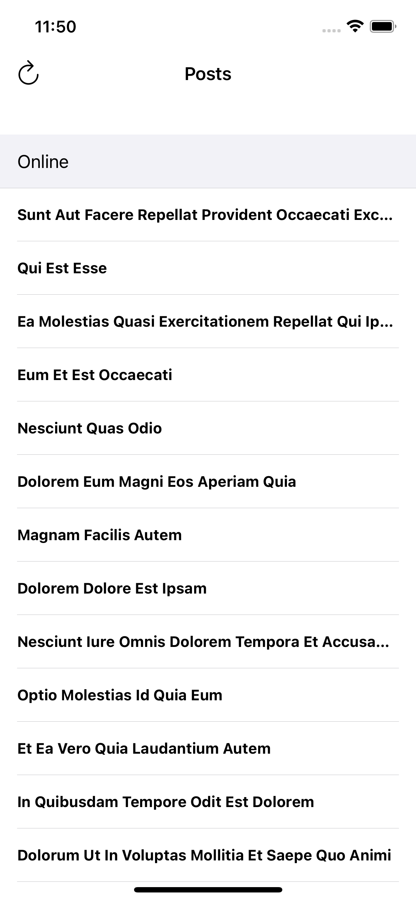
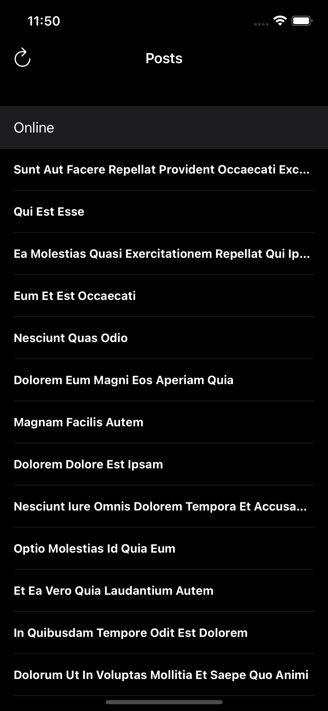

# PostsList

# App Structure

* App structure I use **MVP** with Input-Output approach **Delegate** to notify about updates. I selected **MVP** becasue the app is simpel only 2 screens.

* I used the **Repository** design pattern to act as a Data source from API and from CoreData.

* I Separated the data source of UITableView to other class **PostsTableViewDataSource**.

* I used **CellReusable** protocol and create 2 extensions for UITableView to reduce code when reusing the cell.

* Used `Reachable` and `Reachability.swift` to check the internet connection state.

* Used `LoggerProtocol` and `ProxyLogger.swift` to help me to log the errors.

* Used `DataLoader.swift` to get data from local JSON.

* I used [SwiftLint](https://github.com/realm/SwiftLint) to enhance Swift style.

* I create UI with code.

* I used **SPM** (Swift Package Manager).

* I supported Dark-Light Mode

# Why CoreData?
There's a lot of choices to save the data localy like Coredata, Realm, Squlite, File, UserDefault but I decide to go with Coredata and we can disscuss this later.

# UnitTest
* I apply  **Arrange, Act and Assert (AAA) Pattern** [AAA](https://medium.com/@pjbgf/title-testing-code-ocd-and-the-aaa-pattern-df453975ab80) in Unit Testing.
* I use mocking to Test get data from  NetworkManager, I use the same JSON file to mock data.
* Use ***SnapshotTest*** to Test PostsListViewController

## Demo

## Info

Name: Dimo Hamdy
Email: dimo.hamdy@gmail.com
